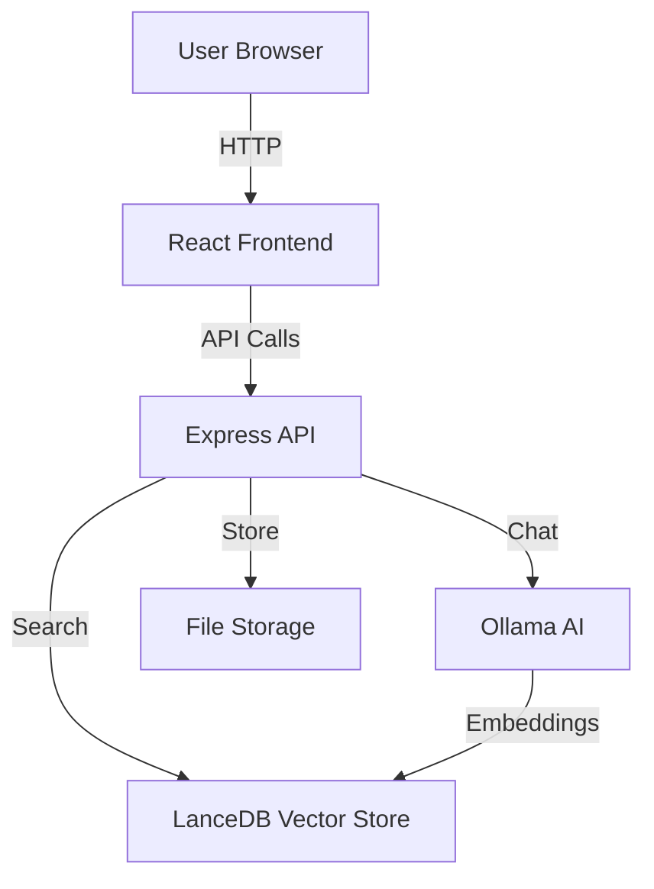

# 🏗️ System Architecture

## Overview

The Customer Support AI Assistant follows a **modern full-stack architecture** with clear separation of concerns between the client, API gateway, AI services, and data layers.

---

## High-Level Architecture

```
┌─────────────────────────────────────────────────────────────────────────────┐
│                              CLIENT LAYER                                    │
│  ┌─────────────────────────────────────────────────────────────────────────┐  │
│  │  React 19 + TypeScript + Tailwind CSS + Vite                         │  │
│  │                                                                        │  │
│  │  ┌──────────────┐  ┌──────────────┐  ┌──────────────┐                │  │
│  │  │ Chat         │  │ Document     │  │ Admin        │                │  │
│  │  │ Interface    │  │ Upload       │  │ Dashboard    │                │  │
│  │  └──────────────┘  └──────────────┘  └──────────────┘                │  │
│  └─────────────────────────────────────────────────────────────────────────┘  │
└──────────────────────────────────┬────────────────────────────────────────────┘
                                   │ HTTP / SSE
                                   ▼
┌─────────────────────────────────────────────────────────────────────────────┐
│                             API GATEWAY                                      │
│  ┌─────────────────────────────────────────────────────────────────────────┐  │
│  │  Express.js + TypeScript                                               │  │
│  │                                                                        │  │
│  │  ┌────────────┐ ┌────────────┐ ┌────────────┐ ┌────────────┐        │  │
│  │  │ Documents  │ │ Chat       │ │ Health     │ │ Swagger    │        │  │
│  │  │ Router     │ │ Router     │ │ Router     │ │ UI         │        │  │
│  │  └────────────┘ └────────────┘ └────────────┘ └────────────┘        │  │
│  │                                                                        │  │
│  │  Middleware: Helmet, CORS, Morgan, Body Parser, Error Handler        │  │
│  └─────────────────────────────────────────────────────────────────────────┘  │
└──────────────────────────────────┬────────────────────────────────────────────┘
                                   │
          ┌────────────────────────┼────────────────────────┐
          │                        │                        │
          ▼                        ▼                        ▼
┌─────────────────────┐ ┌─────────────────┐ ┌─────────────────────────┐
│   AI SERVICES       │ │   VECTOR DB     │ │   FILE STORAGE          │
│                     │ │                 │ │                         │
│  ┌───────────────┐  │ │  ┌───────────┐  │ │  ┌───────────────────┐  │
│  │ Ollama LLM    │  │ │  │ LanceDB   │  │ │  │ Uploads           │  │
│  │ (llama3.2)    │  │ │  │ + Vectors │  │ │  │ Directory         │  │
│  │               │  │ │  │             │  │ │  │                   │  │
│  │ • Chat        │  │ │  │ • Semantic│  │ │  │ • PDF files       │  │
│  │ • Streaming   │  │ │  │   Search  │  │ │  │ • DOCX files      │  │
│  │ • Embeddings  │  │ │  │ • Cosine  │  │ │  │ • TXT files       │  │
│  └───────────────┘  │ │  │   Similarity│  │ │  └───────────────────┘  │
│                     │ │  └───────────┘  │ │                         │
│  ┌───────────────┐  │ │                 │ │                         │
│  │ nomic-embed   │  │ │                 │ │                         │
│  │ -text         │  │ │                 │ │                         │
│  │               │  │ │                 │ │                         │
│  │ • 768-dim     │  │ │                 │ │                         │
│  │   vectors     │  │ │                 │ │                         │
│  └───────────────┘  │ │                 │ │                         │
└─────────────────────┘ └─────────────────┘ └─────────────────────────┘
```

---

## Component Details

### 1. Client Layer (Frontend)

**Technology Stack:**
- React 19 with TypeScript
- Vite (build tool)
- Tailwind CSS (styling)
- Lucide React (icons)

**Key Components:**

| Component | File | Purpose |
|-----------|------|---------|
| `ChatInterface` | `client/src/components/ChatInterface.tsx` | Main chat UI with message history |
| `DocumentUpload` | `client/src/components/DocumentUpload.tsx` | Drag-and-drop file upload |
| `Sidebar` | `client/src/components/Sidebar.tsx` | Navigation between views |

**State Management:**
- React hooks (useState, useEffect, useRef)
- Custom `useChat` hook for chat state
- No external state library needed

---

### 2. API Gateway (Backend)

**Technology Stack:**
- Express.js 4.21 with TypeScript
- Helmet (security headers)
- CORS (cross-origin requests)
- Morgan (HTTP logging)
- Swagger (API documentation)

**Route Structure:**

```
/api
├── /health          → Health check
├── /documents       → Document management
│   ├── POST /       → Upload file
│   ├── GET /        → List documents
│   └── DELETE /:id  → Delete document
├── /chat            → Chat operations
│   ├── POST /       → Send message (JSON)
│   ├── POST /stream → Send message (SSE)
│   ├── GET /sessions → List sessions
│   └── GET /sessions/:id → Get session
└── /docs            → Swagger UI
```

---

### 3. AI Services Layer

#### 3.1 Ollama LLM Service

**Model:** `llama3.2` (or compatible)

**Capabilities:**
- Natural language understanding
- Context-aware responses
- Streaming text generation
- Temperature control (0.7 default)

**Integration:**
```typescript
// server/src/services/ollamaService.ts
POST http://localhost:11434/api/chat
{
  "model": "llama3.2",
  "messages": [...],
  "stream": true
}
```

#### 3.2 Embedding Service

**Model:** `nomic-embed-text`

**Specifications:**
- Output dimensions: 768
- Context length: 8192 tokens
- Optimized for retrieval tasks

**Integration:**
```typescript
POST http://localhost:11434/api/embeddings
{
  "model": "nomic-embed-text",
  "prompt": "text to embed"
}
```

---

### 4. Vector Database (LanceDB)

**Why LanceDB?**
- File-based (no server needed)
- Native vector search
- Fast cosine similarity
- Zero configuration

**Schema:**
```
Table: documents
├── id: string (chunk ID)
├── document_id: string (source document)
├── content: string (chunk text)
├── start_index: int
├── end_index: int
└── vector: float[768] (embedding)
```

**Search Process:**
1. User query → Embedding model
2. Query vector → LanceDB search
3. Top-K results → Context building
4. Context + Query → LLM
5. Response → User

---

### 5. Document Processing Pipeline

```
User Upload
    │
    ▼
┌─────────────┐
│ File Filter │──→ Reject if not PDF/DOCX/TXT
└─────────────┘
    │
    ▼
┌─────────────┐
│   Parser    │──→ Extract raw text
│             │    • pdf-parse (PDF)
│             │    • mammoth (DOCX)
│             │    • native (TXT)
└─────────────┘
    │
    ▼
┌─────────────┐
│   Chunker   │──→ Split into ~800 char chunks
│             │    • Sentence-aware splitting
│             │    • 150 char overlap
└─────────────┘
    │
    ▼
┌─────────────┐
│  Embedder   │──→ Generate 768-dim vectors
│  (Ollama)   │
└─────────────┘
    │
    ▼
┌─────────────┐
│  LanceDB    │──→ Store vectors + metadata
└─────────────┘
```

---

## Data Flow

### Chat Request Flow

```
┌──────┐     ┌──────────┐     ┌──────────┐     ┌──────────┐
│ User │────▶│  React   │────▶│ Express  │────▶│  Chat    │
│      │     │   UI     │     │  Router  │     │ Service  │
└──────┘     └──────────┘     └──────────┘     └────┬─────┘
                                                    │
                       ┌────────────────────────────┤
                       │                            │
                       ▼                            ▼
                ┌────────────┐               ┌────────────┐
                │ VectorStore│               │  Ollama   │
                │  (Search)  │               │  (LLM)    │
                └────────────┘               └────────────┘
                       │                            │
                       └────────────┬───────────────┘
                                    │
                                    ▼
                             ┌──────────┐
                             │ Response │
                             │ (Stream) │
                             └────┬─────┘
                                  │
                                  ▼
                           ┌──────────┐
                           │   User   │
                           └──────────┘
```

### Document Upload Flow

```
┌──────┐     ┌──────────┐     ┌──────────┐     ┌──────────┐
│ User │────▶│  React   │────▶│ Express  │────▶│ Document │
│      │     │  Upload  │     │  Router  │     │ Service  │
└──────┘     └──────────┘     └──────────┘     └────┬─────┘
                                                    │
                       ┌────────────────────────────┤
                       │                            │
                       ▼                            ▼
                ┌────────────┐               ┌────────────┐
                │   Parser   │               │  Chunker  │
                │            │               │            │
                └────────────┘               └────────────┘
                       │                            │
                       ▼                            ▼
                ┌────────────┐               ┌────────────┐
                │  Embedder  │─────────────▶│  LanceDB  │
                │  (Ollama) │               │  (Store)  │
                └────────────┘               └────────────┘
```

---

## Security Architecture

| Layer | Protection | Implementation |
|-------|-----------|----------------|
| HTTP | Security headers | Helmet.js |
| CORS | Origin control | cors middleware |
| Files | Type validation | Multer fileFilter |
| Files | Size limit | Multer limits (10MB) |
| Input | Body parsing | express.json() limit |
| Errors | Leak prevention | Generic error messages in production |

---

## Scalability Considerations

### Current (Single Machine)
- Ollama runs locally
- LanceDB file-based
- In-memory session store

### Future Scaling
| Component | Scale Strategy |
|-----------|---------------|
| LLM | Ollama multi-GPU or switch to vLLM |
| Embeddings | Batch processing, caching |
| Vector DB | Migrate to Pinecone/Weaviate |
| Sessions | Redis-backed session store |
| Files | S3-compatible object storage |
| API | Load balancer + multiple instances |

---

## Technology Decisions

### Why Ollama (not OpenAI/Gemini)?
- ✅ 100% free, no API costs
- ✅ Complete data privacy
- ✅ Works offline
- ✅ No rate limits
- ⚠️ Requires GPU for best performance

### Why LanceDB (not Pinecone/Weaviate)?
- ✅ Zero configuration
- ✅ File-based (no server)
- ✅ Free forever
- ✅ Good performance for <1M vectors
- ⚠️ Not distributed

### Why Express (not Fastify/NestJS)?
- ✅ Familiar, well-documented
- ✅ Large ecosystem
- ✅ Easy to extend
- ⚠️ Less performant than Fastify

---

## Monitoring & Observability

| Tool | Purpose |
|------|---------|
| Winston | Structured application logging |
| Morgan | HTTP request logging |
| /api/health | Health check endpoint |

---

## Diagram Source

This architecture diagram was created using ASCII art for version control compatibility.

For a visual diagram, use:
- [Draw.io](https://draw.io)
- [Excalidraw](https://excalidraw.com)
- [Mermaid](https://mermaid.js.org)

**Mermaid version:**


---

*Last updated: July 2026*
*Author: Arpita Gupta*
